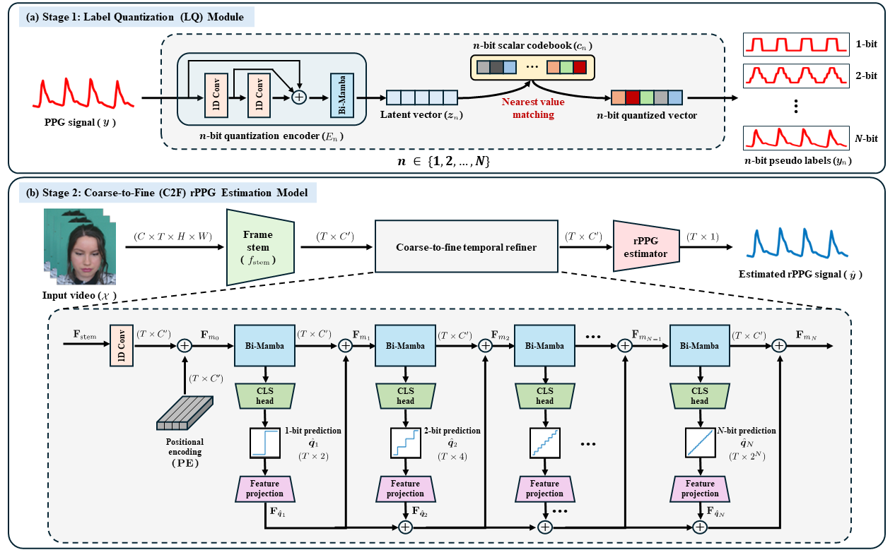

## Overview of Q2F-Phys
Q2F-Phys: A Label-Quantized Coarse-to-Fine Framework for Robust and Efficient Physiological Measurement
<p align="center">
  
</p>

## ⚙️ Setup
To set up the environment for Q2F-Phys, please execute the following script:
```bash
bash setup.sh
```
This will automatically create a dedicated conda environment and install all necessary dependencies. The setup script has been tested and verified on Linux systems. If you are using Windows or macOS, manual installation of dependencies may be required.


## 📁 Datasets
To use Q2F-Phys, it is necessary to prepare appropriate benchmark datasets.  
Please refer to the following publications for details on each dataset.

- **MMPD**  
  - Jiankai Tang, Kequan Chen, Yuntao Wang, Yuanchun Shi, Shwetak Patel, Daniel McDuff, Xin Liu,  
    *"MMPD: Multi-Domain Mobile Video Physiology Dataset"*, IEEE EMBC, 2023.

- **UBFC-rPPG**  
  - S. Bobbia, R. Macwan, Y. Benezeth, A. Mansouri, J. Dubois,  
    *"Unsupervised skin tissue segmentation for remote photoplethysmography"*, Pattern Recognition Letters, 2017.

- **PURE**  
  - R. Stricker, S. Müller, H.-M. Gross,  
    *"Non-contact Video-based Pulse Rate Measurement on a Mobile Service Robot"*,  
    Proc. IEEE Int. Symposium on Robot and Human Interactive Communication (RO-MAN), 2014.


## 🖥️ Testing with Pre-trained Models
Please refer to the configuration files located in `./configs/infer_configs`.

### Intra-Dataset Evaluation (Example)
To run the pre-trained model for **intra-dataset** evaluation (i.e., training and testing on the same dataset), you can use the following example:

- **MMPD → MMPD**:
```bash
python main.py --config_file ./configs/infer_configs/MMPD_MMPD_Q2FPhys.yaml
```

### Cross-Dataset Evaluation (Examples)
To run the pre-trained model for **cross-dataset** evaluation (i.e., training and testing on different datasets), you can refer to the following examples:

- **PURE → UBFC**:
```bash
python main.py --config_file ./configs/infer_configs/PURE_UBFC_Q2FPhys.yaml
```

- **UBFC → PURE**:
```bash
python main.py --config_file ./configs/infer_configs/UBFC_PURE_Q2FPhys.yaml
```


## 🧮 Computing Model Complexity
To calculate the model's number of parameters, MACs (multiply–accumulate operations), and throughput:
```
python model_Para_MACs_Thro.py
```


## 🎓 Acknowledgement
This work builds upon the [rPPG-Toolbox](https://github.com/ubicomplab/rPPG-Toolbox) [1].  
We sincerely thank the authors for providing this valuable resource to the community.


## References
[1] Liu, Xin, et al. "rppg-toolbox: Deep remote ppg toolbox." *Advances in Neural Information Processing Systems*, vol. 36, 2024.
