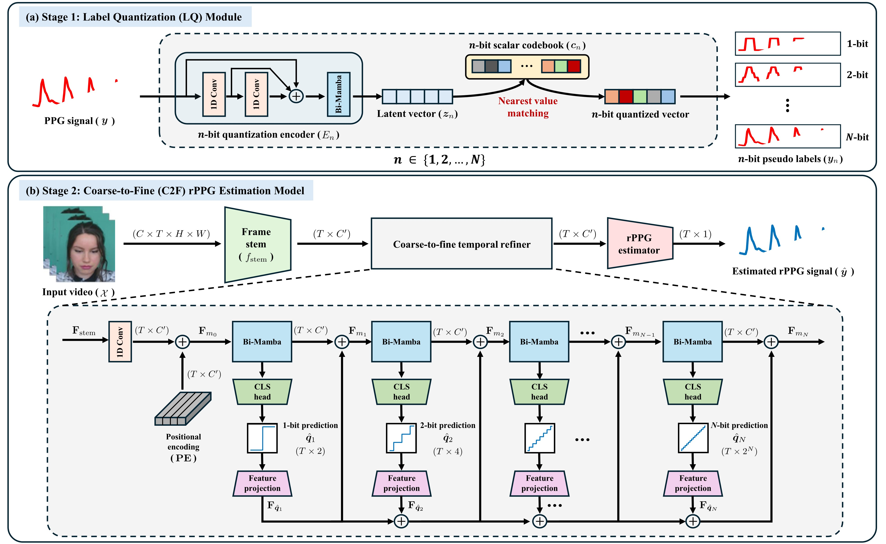

## Overview of Q2F-Phys
Q2F-Phys: A Label-Quantized Coarse-to-Fine Framework for Robust and Efficient Physiological Measurement

  

## 🎓 Acknowledgement
Our framework was implemented based on the [rPPG-Toolbox](https://github.com/ubicomplab/rPPG-Toolbox) [1], and additionally incorporates [RhythmMamba](https://github.com/zizheng-guo/RhythmMamba) [2] as a baseline model for comparison.

## References
[1] Liu, Xin, et al. "rppg-toolbox: Deep remote ppg toolbox." *Advances in Neural Information Processing Systems*, vol. 36, 2024.

[2] Zou, Bochao, et al. "Rhythmmamba: Fast remote physiological measurement with arbitrary length videos." *arXiv preprint* arXiv:2404.06483, 2024.
